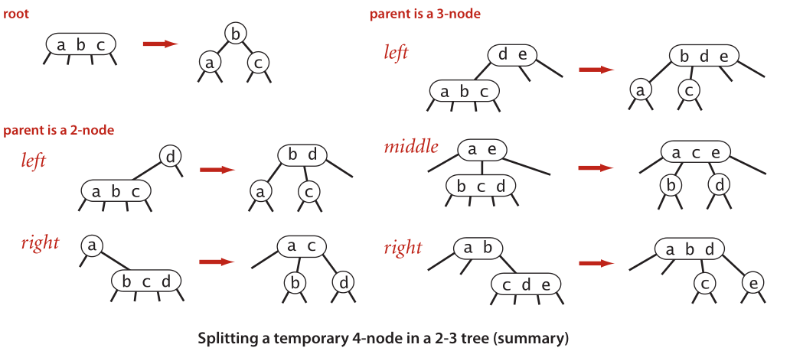
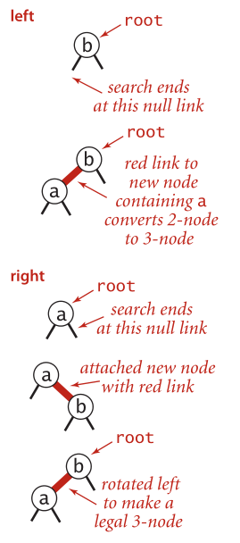
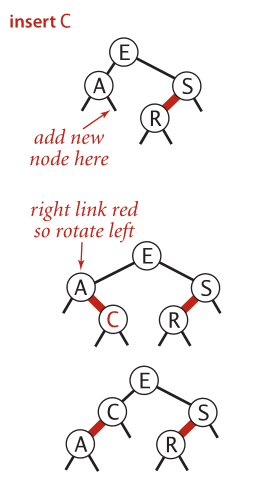
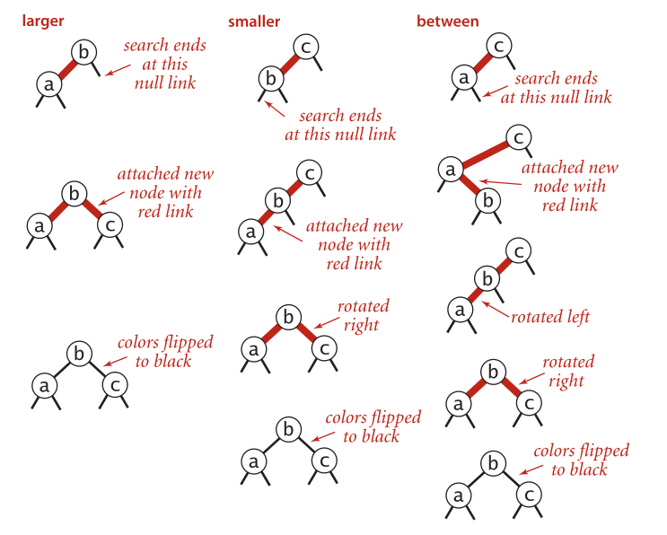
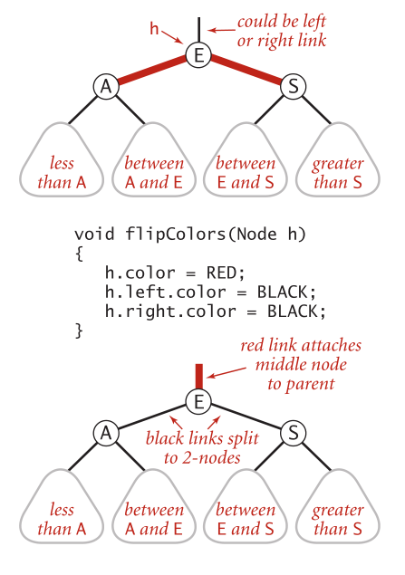
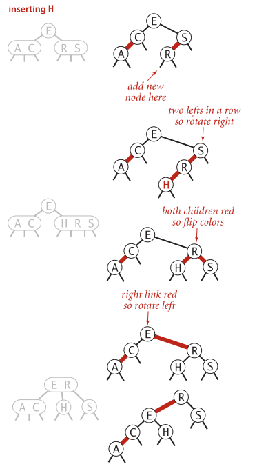
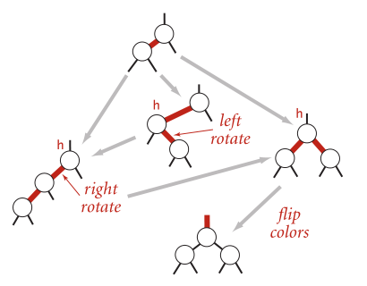
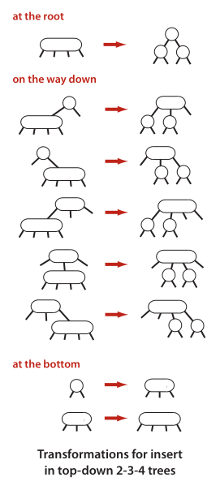
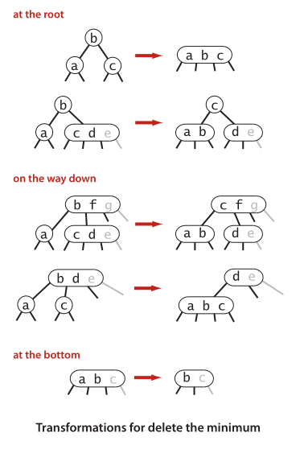

# 平衡查找树

## 2-3 查找树

### 定义

一棵 2-3 查找树或为一棵空树，或由以下结点组成：

* 2- 结点，含有一个键（及其对应的值）和两条链接，左链接指向的 2-3 树中的键都小于该结点，右链接指向的 2-3 树中的键都大于该结点。
* 3- 结点，含有两个键（及其对应的值）和三条链接，左链接指向的 2-3 树中的键都小于该结点，中链接指向的 2-3 树中的键都位于该结点两个键之间，右链接指向的 2-3 树中的键都大于该结点。

同时，我们将指向一棵空树的链接称为**空链接**。 

<div align="center">


<p>2-3 查找树示意图</p>

</div>

一棵**完美**平衡的 2-3 查找树中的所有空链接到根节点的距离都应该是相同的。

### 查找

2-3 树的查找方法与二叉树的类似。

要判断一个键是否在树中，我们先将它和根节点中的键相比较。如果它和其中一个相等，查找命中；否则我们根据比较的结果找到指向相应区间的链接，并在其指向的子树中递归地继续查找。如果这是个空链接，查找未命中。

<div align="center">


<p>2-3 树中的查找命中（左）和未命中（右）</p>

</div>

### 插入

要在 2-3 树中插入一个新结点，我们可以和二叉树一样先进行一次未命中的查找，然后把新结点挂在树的底部。但这样的话树无法保持完美平衡性。我们使用 2-3 树的主要云隐就在于它能够在插入后继续保持平衡。

所以下面我们将分情况讨论。

#### 向 2- 结点中插入新建

如果未命中的查找结束于一个 2- 结点，那事情就好办：我们将这个 2- 结点替换为一个 3- 结点，将要插入的键保存在其中即可。

<div align="center">


<p>向 2- 结点中插入新键</p>

</div>

#### 向一棵只含有一个 3- 结点的树中插入新键

这棵树有两个键，所以在它的唯一的结点中已经没有可插入新键的空间了。

为了将新键插入，我们先临时将新键存入该结点中，使之成为一个 4- 结点。它很自然地扩展了以前的结点并含有 3 个键和 4 条链接。

创建一个 4- 结点很方便，因为很容易将它转换为一棵由 3 个 2- 结点组成的 2-3 树，其中一个结点（根）含有中间，一个结点含有 3 个键中的最小者（和根结点的左链接相连），一个结点含有 3 个键中最大者（和根结点的右链接相连）。

<div align="center">


<p>向一棵含有一个 3- 结点的数中插入新键</p>

</div>

#### 向一个父节点为 2- 结点的 3- 结点插入新键

我们像刚才一样构造一个临时的 4- 结点并将其分解，但此时我们不会为中键创建一个新结点，而是将其移动至原来的父结点中。

根据我们的假设，父结点中是有空间的：父结点是一个 2- 结点，插入之后变成了一个 3- 结点。

<div align="center">


<p>向一个父节点为 2- 结点的 3- 结点插入新键</p>

</div>

#### 向一个父结点为 3- 结点的 3- 结点插入新键

现在假设未命中的查找结束于一个父结点为 3- 结点的 3- 结点。我们再次和刚才一样构造一个临时的 4- 结点并分解它，然后将它的中键插入它的父结点中。

但父结点也是一个 3- 结点，因此我们再用这个中键构造一个临时的 4- 结点，然后**在这个结点上进行相同的变换**，即分解这个父结点并将它的中键插入到它的父结点中。

推广到一般情况，我们就这样一直向上不断分解临时的 4- 结点并将中键插入更高层的父结点，直至遇到一个 2- 结点并将它替换为一个不需要继续分解的 3- 结点，或者是到达 3- 结点的根。

<div align="center">


<p>向一个父结点为 3- 结点的 3- 结点插入新键</p>

</div>

#### 分解根结点

如果从插入结点到根结点的路径上全是 3- 结点，我们的根结点最终变成一个临时的 4- 结点。此时我们可以按照向一棵只有一个 3- 结点的树中插入新键的方法处理这个问题。将临时的 4- 结点分解为 3 个 2- 结点，使得**树高加 1**。

<div align="center">


<p>分解根结点</p>

</div>

#### 局部变换

将一个 4- 结点分解为一棵 2-3 树可能有 6 中情况，都总结在下图中。这个 4- 结点可能是根结点，可能是一个 2- 结点的左子结点或者右子结点，也可能是一个 3- 结点的左子结点、中子结点和右子结点。

2-3 树的插入算法的根本在于这些变换都是**局部**的：除了相关的结点和链接之外不必修改或者检查树的其他部分。 

每次变换中，变更的链接数量不会超过一个很小的的常数。需要特别指出的是，不光是在树的底部，书中的**任何地方**只要符合相应的模式，变换都可以进行。

每个变换都会将 4- 结点中的一个键送入它的父结点中，并重构相应的链接而不必涉及树的其他部分。

<div align="center">





<p>在一棵 2-3 树中分解一个 4- 结点的情况汇总</p>

</div>

#### 全局性质

这些**局部**变换不会影响树的**全局**有序性和平衡性：任意空链接到根结点的路径长度都是相等的。

## 红黑树

上文所述的 2-3 树的插入算法并不难理解，现在我们也会看到它也不难实现。我们要学习一种名为红黑二叉查找树的简单数据结构来表达并实现它。

### 替换 3- 结点

红黑二叉查找树背后的基本思想是用标准的二叉查找树（完全由 2- 结点组成）和一些额外的信息（替换 3- 结点）来表示 2-3 查找树。

我们将树中的链接分为两种类型：**红链接**将两个 2- 结点连接起来构成一个 3- 结点，**黑链接**则是 2-3 树中的普通链接。确切地说，我们将 3- 结点表示为由一条**左斜**的红链接（两个 2- 结点的其中之一是另一个的左子结点）相连的两个 2- 结点。

<div align="center">


<p>由一条红色左链接相连的两个 2- 结点 表示一个 3- 结点</p>

</div>

### 一种等价的定义

红黑树的另一种**定义**是含有红黑链接并满足下列条件的二叉查找树：

* 红色链接均为左链接；
* 没有任何一个结点同时和两条红链接相连；
* 该树是**完美**黑色平衡，即任意空链接到根结点的路径上的黑链接数量相同。

### 一一对应

如果我们将一棵红黑树中红链接画平，那么所有空链接到根结点的距离都将是相同的。


<div align="center">


<p>将红链接画平，一棵红黑树就是一棵 2-3 树</p>


</div>

如果我们将红链接相连的结点合并，得到的就是一棵 2-3 树。相反，如果将一棵 2-3 树中的 3- 结点画作由红色左链接相连的两个 2- 结点，那么不会存在能够和两条红链接相连的结点，且树必然是完美黑色平衡，因为黑链接就是 2-3 树中的普通链接，根据定义这些链接必然是完美平衡的。

<div align="center">


<p>红黑树和 2-3 树中的一一对应关系</p>

</div>

### 颜色表示

因为每个结点都只会有一条指向自己的链接（从它的父结点指向它)，我们将链接的颜色保存在表示结点的 Node 数据类型的布尔变量 color 中。如果指向它的链接是红色，则该变量为 true，否则为 false。同时，我们约定**空链接为黑色**。

为了代码的清晰，我们定义了两个常量 `RED` 和 `BLACK` 来设置和测试这个变量。我们使用私有方法 isRed() 来测试一个结点和它的父结点之间的链接的颜色。

**注意**：当我们提到一个结点的颜色时，我们指的是指向该结点的链接的颜色，反之亦然。

```java
private static final boolean RED = true;
private static final boolean BLACK = false;

private class Node {
    Key key;
    Value val;
    Node left, right;
    int N;
    boolean color;
    
    private Node(Key key, Value val, int N, boolean color) {
        this.key = key;
        this.val = val;
        this.N = N;
        this.color = color;
    }
}

private boolean isRed(Node x) {
    if (x == null) return false;
    else return x.color == RED;
}
```

<div align="center">


<p>红黑树的结点表示</p>

</div>

### 旋转

在我们实现某些操作中可能会出现红色右链接或者两条连续的红链接，但在操作完成前，这些情况都会被小心地**旋转**并修复。

假设有一条红色的右链接需要被转化为左链接，这个操作叫做**左旋转**，它对应的方法接受一条指向红黑树中的某个结点作为参数。假设被指向的结点的右链接是红色的，这个方法会对树进行必要的调整并返回一个指向包含同一组键的子树且其左链接为红色的根结点的链接。

实现将一个红色左链接转换为一个红色右链接的一个**右旋转**操作的代码完全相同，只需要将 left 和 right 互换即可。

<div align="center">


<p>左旋转 h 的右链接</p>


<p>右旋转 h 的左链接</p>

</div>

### 在旋转后重置父结点的链接

无论左旋转还是右旋转，旋转操作都会返回一条链接。我们总是会用 rotateRight() 或 rotateLeft() 的返回值重置父结点（或是根结点）的相应链接。返回的链接可能是左链接也可能是右链接，但是我们总会将它赋予父结点中的链接。

这个链接可能是红色也可能是黑色 —— rotateLeft() 和 rotateRight() 都通过将 x.color 设为 h.color 保留它原来的颜色。

这可能会产生两条连续的红链接，但我们算法会继续用旋转操作修正这种情况。

在插入新的键时我们可以使用旋转操作帮助我们保证 2-3 树和红黑树之间的一一对应关系，因为旋转操作可以保持红黑树的两个重要性质：**有序性**和**完美平衡性**。也就是说，我们在红黑树中进行旋转时无需为树的有序性和完美平衡性担心。

下面我们来看看应该如何使用旋转操作保持红黑树的另外两个重要性质（不存在两条连续的红链接和不存在红色的右链接）。

### 插入

#### 向单个 2- 结点插入新键

一棵只有一个键的红黑树只含有一个 2- 结点。插入另一个键后，我们马上就需要将它们旋转。

如果新键小于老键，我们只需要新增一个红色结点即可，新的红黑树和单个 3- 结点完全等价。

如果新键大于老键，那么新增的红色结点将会产生一个红色右链接。我们需要使用 root = rotateLeft(root)；来将其旋转为红色左链接并修正根结点的链接，插入操作才算完成。

<div align="center">





<p>向单个 2- 结点插入一个新键</p>

</div>

#### 向树底部的 2- 结点插入新键

用和二叉查找树相同的方式向一棵红黑树中插入一个新键会在树底部新增一个结点（为了保证有序性），但**总是用红链接将新结点和父结点相连**。如果它的父结点是 2- 结点，那么刚才讨论的两种处理方法仍然适用。

如果指向新结点的是父结点的左链接，那么父结点就直接成为了一个 3- 结点；如果指向新结点的是父结点的右链接，这就是一个错误的 3- 结点，但一次左旋转就能够修正它。

<div align="center">





<p>向树底部的 2- 结点插入一个新键</p>

</div>

#### 向一棵双键树（即一个 3- 结点）中插入新键

这种情况又可分为三种情况：新键小于树中的两个键，在两者之间，或是大于树中的两个键。每种情况都会产生一个同时连接两条红链接的结点，而我们目标就是修正这一点。

* 三者中最简单的情况是新键大于原树中的两个键，因此它被连接到 3- 结点的右链接。此时树是平衡的，根结点为中间大小的键，它有两条红链接分别和较小和较大的结点相连。如果将两条链接的颜色都红变黑，那么我们就得到了一棵由三个结点组成、高为 2 的平衡树。它正好能够对应一棵 2-3 树。

  其他两种情况最终也会转化为这种情况。

* 如果新键小于原树中的两个键，它被连接到最左边的空链接，这样就产生了两条连续的红链接。此时我们只需要将上层的红链接右旋转即可得到第一种情况。

* 如果新键介于两个键之间，这又会产生两条连续的红链接，一条红色左链接接一条红色右链接。此时我们只需要将下层的红链接左旋转即可得到第二种情况。

**注意：任意两条连续的红链接相当于一个临时的 4- 结点**。但情况一我们想要的 4- 结点，而情况二，三则不是我们想要的 4- 结点,所以我们通过旋转操作使情况二，三变成情况一。

<div align="center">





<p>向一颗双键树（即一个 3- 结点）中插入一个新键的三种情况</p>


</div>

#### 颜色转换

我们专门有一个方法 flipColors() 来转换一个结点的两个红色子结点的颜色。除了将子结点的颜色由红变黑之外，我们同时还要将父结点的颜色由黑变红。

这项操作最重要的性质在于它和旋转操作一样是局部变换，不会影响整棵树的黑色平衡性。

<div align="center">





<p>通过转换链接的颜色来分解 4- 结点</p>

</div>

#### 根结点总是黑色

在分解 4- 结点时，颜色转换可能会使根结点由黑变红。严格地说，红色的根结点说明根结点是一个 3- 结点的一部分，但实际情况并不是这样。因此，我们在每次插入后都会将根结点的颜色设为黑色。

#### 向树底部的 3- 结点插入新键

现在假设我们需要在树的底部的一个 3- 结点下加入一个新的结点。前面讨论的三种情况都会出现。

指向新结点的链接可能是 3- 结点的右链接，或是左链接，或是中链接。颜色转换为使到中结点的链接变红，相当于将它送入了父结点。

这意味着在**父结点中插入一个新键**，我们也会继续用相同的办法解决这个问题。

<div align="center">





<p>向树底部的 3- 结点插入一个新键</p>

</div>

#### 将红链接在树中向上传递

2-3 树中的插入算法需要我们分解 3- 结点，将中间键插入父结点，如此这般直到遇到一个 2- 结点或是根结点。

我们所考虑过的所有情况都正是为了达成这个目标：每次必要的旋转之后我们都会进行颜色转换，这使得中结点变红。在父结点看来，处理这样一个红色结点的方式和处理一个新插入的红色结点完全相同，即继续把红链接转移到中结点上去。

下图中总结的三种情况显示了在红黑树实现 2-3 树插入算法的关键步骤：要在一个 3- 结点下插入新键，先创建一个临时的 4- 结点，将其分解并将红链接由中间键传递给它的父结点。重复这个过程，我们就能将红链接在树中向上传递，直至遇到一个 2- 结点或者根结点。

<div align="center">





<p>红黑树中红链接向上传递</p>

</div>

总之，只要谨慎地使用左旋转、右旋转和颜色转换这三种简单的操作，我们就能够保证插入操作后红黑树和 2-3 树的一一对应关系。在沿着插入点到根结点的路径向上移动时在所经过的每个结点中顺序完成以下操作，我们就能够完成插入操作：

* 如果右子结点是红色的而左子结点是黑色的，进行左旋转；
* 如果左子点是红色的且它的左子结点也是红色，进行右旋转；
* 如果左右子结点均为红色，进行颜色转换。


#### 红黑树的插入算法

```java
public class RedBlackBST<Key extends Comparable<Key>, Value> {
    private Node root;

    private class Node

    private boolean isRed(Node h)
    private Node rotateLeft(Node h)
    private Node rotateRight(Node h)
    private void flipColors(Node h)
	private int size(Node x)

    public void put(Key key, Value val) {
        root = put(root, key, val);
        root.color = BLACK;
    }

    private Node put(Node h, Key key, Value val) {
        if (h == null) {
            return new Node(key, val, 1, RED);
        }

        int cmp = key.compareTo(h.key);
        if      (cmp < 0) h.left = put(h.left, key, val);
        else if (cmp > 0) h.right = put(h.right, key, val);
        else              h.val = val;

        if (!isRed(h.left) && isRed(h.right))    h = rotateLeft(h);
        if (isRed(h.left) && isRed(h.left.left)) h = rotateRight(h); 
        if (isRed(h.left) && isRed(h.right))     flipColors(h);

        h.N = size(h.left) + size(h.right) + 1;
        return h;
    }
}
```

### 删除

要描述删除算法，我们先回到 2-3 树。和插入操作一样，我们也可以定义一系列局部变换来在删除一个结点的同时保持树的完美平衡性。

这个过程比插入一个结点更加复杂，因为我们不仅要在（为了删除一个结点而）构造临时 4- 结点时沿着查找路径**向下**进行变换，还要在分解遗留的 4- 结点时沿着查找路径**向上**进行变换（**同插入操作**）。

#### 自顶向下的 2-3-4 树

作为第一轮热身，我们先学习一个沿查找路径既能向上也能向下进行变换的稍简单的算法： 2-3-4 树的插入算法，2-3-4 树中允许存在我们之前见过 4- 结点。

它的**插入**算法沿查找路径向下进行变换是为了保证**当前结点不是 4- 结点**（这样树底才有空间来插入新的键），沿查找路径向上进行变换是为了将之前创建的 4- 结点配平。

向下的变换和我们在 2-3 树中分解 4- 结点所进行的变换完全相同。如果根结点是 4- 结点，则将它分解成 3 个 2- 结点。

在向下查找过程中，如果遇到一个父结点为 2- 结点的 4- 结点，我们将 4- 结点分解为两个 2- 结点并将中间键传递给它的父结点，使得父结点变为一个 3- 结点；如果遇到一个父结点为 3- 结点的 4- 结点，我们将 4- 结点分解为两个 2- 结点并将中间键传递给它的父结点，使得父结点变为一个 4- 结点；我们不必担心会遇到父结点为 4- 结点的 4- 结点，因为插入算法本身就保证了这种情况不会出现。

到达树的底部之后，我们也只会遇到 2- 结点或者 3- 结点，所以我们可以插入新的键。

要用红黑树实现这个算法，我们需要：

* 将 4- 结点表示为三个 2- 结点组成的一棵**平衡**的子树，根结点和两个子结点都用红链接相连；
* 在**向下**的过程中分解所有 4- 结点并进行颜色转换；
* 和插入操作一样，在**向上**的过程总用旋转将 4- 结点配平。

<div align="center">





<p>自顶向下的 2-3-4 树的插入算法中的变换</p>


</div>

#### 删除最小键

在第二轮热身中，我们要学习 2-3 树中删除最小键的操作。

我们注意到从树底部的 3- 结点中删除一个键是很简单的，但 2- 结点则不然。从 2- 结点中删除一个键会留下一个空结点，一般我们会将它转换为一个空链接，但这样会破坏树的完美平衡性。所以我们需要这样做：为了保证我们不会删除一个 2- 结点，我们沿着左链接向下进行变换，**确保当前结点不是 2- 结点**（可能是 3- 结点，也可能是临时的 4- 结点）。

首先根结点有两种情况。如果根是 2- 结点并且它的两个子结点都是 2- 结点，我们可以直接将这三个结点变成一个 4- 结点；否则我们需要保证根结点的左子结点不是 2- 结点，如有必要可以从它的右侧的兄弟结点“借”一个键来。

在沿着左链接向下的过程中，保证以下情况之一成立：

* 如果当前结点的左子结点不是 2- 结点，完成；
* 如果当前结点的左子结点是 2- 结点而它的亲兄弟结点不是 2- 结点，将左子结点的兄弟结点中的一个键移动到左结点中；
* 如果当前结点的左子结点和它的亲兄弟结点都是 2- 结点，将左子结点，父结点中的最小键和左子结点最近的兄弟结点合并成为一个 4- 结点，使父结点由 3- 结点变为 2- 结点或者由 4- 结点变为 3- 结点。 

在遍历的过程中执行这个过程，最后能够得到一个含有最小键的 3- 结点或者 4- 结点，然后我们可以直接从中将其删除，将 3- 结点变为 2- 结点，或者将 4- 结点变为 3- 结点。然后我们再回头向上分解所有临时的 4- 结点。

<div align="center">





<p>删除最小键操作中的变换</p>

</div>

#### 删除操作

在查找路径上进行和删除最小键**相同的变换**同样可以保证在查找过程中任意当前结点均不是 2- 结点。如果被查找的键在树的底部，我们可以直接删除它，如果不在，我们需要将它和后继结点交换，就和二叉查找树一样。

因为当前结点必然不是 2- 结点，问题已经转化为在一棵根结点不是 2- 结点的子树中删除最小的键，我们可以在这棵子树中使用前文所述的算法。和以前一样，删除之后我们需要向上回溯并分解余下的 4- 结点。


#### 红黑树的删除算法

在删除操作中，由于在遇到当前结点的左右子结点均为 2- 结点时，我们需要将这个当前结点的最小键、左子结点和右子结点合并为一个 4- 结点，因此我们需要进行颜色转换操作，将当父结点中的最小键的颜色由红变黑，左右子结点的颜色由黑变红。

为了避免写重复代码，这里将上文的 flipColors() 函数修改（如下所示）。这样即可合并 3 个 2- 结点变成 4- 结点，也可将 4- 结点 分解为 3 个 2-结点。

```java
// flip the colors of a node and its two children
private void flipColors(Node h) {
    h.color = !h.color;
    h.left.color = !h.left.color;
    h.right.color = !h.right.color;
}
```
同时，由于我们在删除操作中的向上回溯时所进行的变换，与插入操作中沿路径向上的一样，因此我们将其该操作整合为 balance() 函数：

```java
private Node balance(Node h) {
    if (!isRed(h.left) && isRed(h.right))    h = rotateLeft(h);
    if (isRed(h.left) && isRed(h.left.left)) h = rotateRight(h); 
    if (isRed(h.left) && isRed(h.right))     flipColors(h);

    h.N = size(h.left) + size(h.right) + 1;
    return h;
}
```

**删除最小键：**

```java
public void deleteMin() {
    // 如果根结点是 2- 结点，为了配合上文中 “确保当前结点不是 2- 结点”
    // 将其颜色变为红色，假装其跟某个不存在的结点形成 3- 结点
    if (!isRed(root.left) && !isRed(root.right)) {
        root.color = RED;
    }
    root = deleteMin(root);
    // 恢复根结点的颜色
    if (!isEmpty()) {
        root.color = BLACK;
    }
}

private Node deleteMin(Node h) {
    // 当前结点是最小键
    if (h.left == null) {
        return null;
    }
    // 检测当前结点的左子结点是否为 3- 结点
    // 左子结点可以和 h 或者 h.left.left 形成 3- 结点
    if (!isRed(h.left) && !isRed(h.left.left)) {
        // 左子结点为 2- 结点
        h = moveRedLeft(h);
    }

    h.left = deleteMin(h.left);
    // 沿查找路径向上分解所有临时的 4- 结点
    return balance(h);
}

// 将左子结点变为 3- 结点
private Node moveRedLeft(Node h) {
    // 首先将父结点、左子结点和右子结点合并为 4- 结点或者 5- 结点
    flipColors(h);

    // 合并后为 5- 结点（即右子结点原本是 3- 结点）
    // 因此从父结点中拉最小键放到左子结点，左子结点变成 3- 结点
    // 父结点的空位由右子结点中的最小键填补，父结点依旧是 3- 结点或者 4-结点
    // 右子结点变为 2- 结点
    if (isRed(h.right.left)) {
        h.right = rotateRight(h.right);
        h = rotateLeft(h);
        flipColors(h);
    }
    return h;
}
```

**删除最大键：**

```java
public void deleteMax(){
    // 原因同上
    if (!isRed(root.left) && !isRed(root.right)) {
        root.color = RED;
    }
    root = deleteMax(root);
    if (!isEmpty()) {
        root.color = BLACK;
    }
}

private Node deleteMax(Node h) {
    // 因为红链接都是左链接，所以先将其转换为右链接
    // 可以理解为此时的红黑树的 3- 结点表示为
    // 由一条右斜的红色链接相连的 2- 结点
    if (isRed(h.left)) {
        h = rotateRight(h);
    }
    // 当前结点是最大键
    if (h.right == null) {
        return h;
    }
    // 检测当前结点的右子结点是否为 3- 结点
    // 右子结点可以和 h 或者 h.right.left 形成 3- 结点
    if (!isRed(h.right) && !isRed(h.right.left)) {
        // 右子结点为 2- 结点
        h = moveRedRight(h);
    }

    h.right = deleteMax(h.right);
    // 沿查找路径向上分解所有临时的 4- 结点
    return balance(h);
}

private Node moveRedRight(Node h) {
    // 首先合并当前结点、左子结点和右子结点
    // 形成 4- 结点或者 5- 结点
    flipColors(h);

    // 发现左子结点是 3- 结点
    // 从父结点中拉最小键放到右子结点，右子结点变成 3- 结点
    // 父结点中的空位由左子结点的最小键填补，父结点依旧是 3- 结点或 4- 结点
    // 左子结点变成 2- 结点
    if (isRed(h.left.left)) {
        h = rotateRight(h);
        flipColors(h);
    }
    return h;
}
```

**删除任意键：**

```java
public void delete(Key key) {
    if (!contains(key)) {
        // 如果要删除的键不在树中，则什么都不做
        return;
    }
    // 原因同上
    if (!isRed(root.left) && !isRed(root.right)) {
        root.color = RED;
    }
    root = delete(root, key);
    if (!isEmpty()) {
        root.color = BLACK;
    }
}

private Node delete(Node h, Key key) {
    int cmp = key.compareTo(h.key);
    if (cmp < 0) {
        // 沿左链接递归执行删除操作
        // 同时保证当前结点的左子结点不是 2- 结点
        if (!isRed(h.left) && !isRed(h.left.left)) {
            h = moveRedLeft(h);
        }
        h.left = delete(h.left, key);
    } else {
        // 红链接是左链接，转化为右链接
        if (isRed(h.left)) {
            h = rotateRight(h);
        }
        // 当前结点是要删除的结点，且其右子结点为空结点
        if (cmp == 0 && h.right == null) {
            return null;
        }
        // 确保当前结点的右子结点不是 2- 结点
        if (!isRed(h.right) && !isRed(h.right.left)) {
            h = moveRedRight(h);
        }
        if (cmp == 0) {
            // 当前结点是要删除的结点且右子结点不为空
            Node x = min(h.right);
            // 和右子树中的最小键交换值
            h.key = x.key;
            h.val = x.val;
            // 删除右子树的最小键
            h.right = deleteMin(h.right);
        } else {
            // 沿右链接递归执行删除操作
            // 上面已执行“确保当前结点的右子节点不是 2- 结点”的操作
            h.right = delete(h.right, key);
        }
    }
    // 沿查找路径向上修复所有错误的红色右链接和分解所有临时的 4- 结点
    return balance(h);
}
```

## 参考链接

[3.3   Balanced Search Trees](http://algs4.cs.princeton.edu/33balanced/)

[2-3 树与红黑树](https://riteme.github.io/blog/2016-3-12/2-3-tree-and-red-black-tree.html)